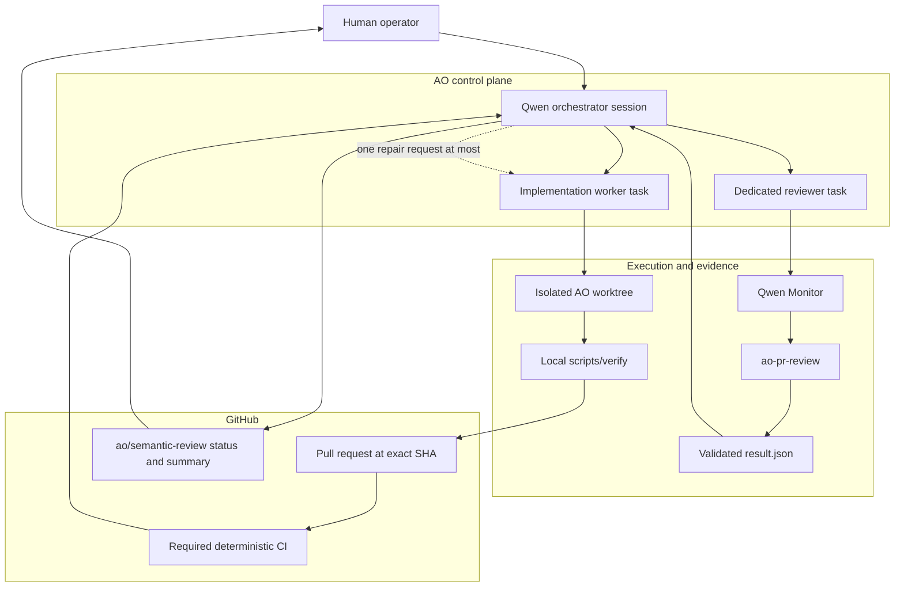
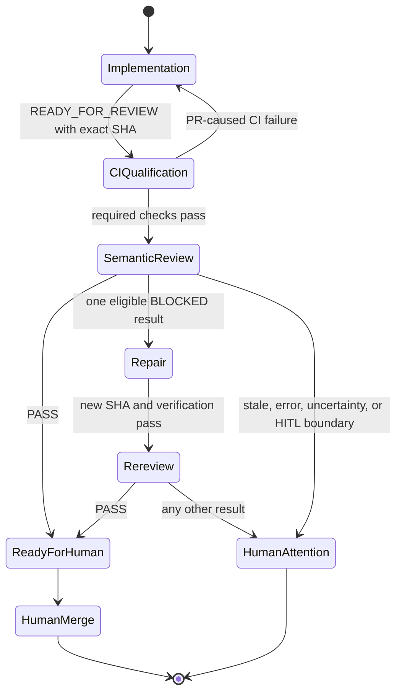
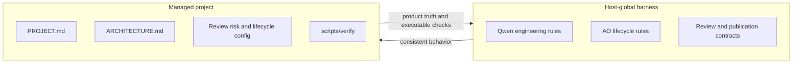

# AO + Qwen Code Harness

[](https://github.com/ensingerphilipp/AO-QwenCode-Harness/actions/workflows/verify.yml)

A reusable, production-oriented baseline for running **Agent Orchestrator (AO)** with **Qwen Code** as a controlled pull-request development system.

AO owns workflow state and authority. Qwen Code performs role-scoped reasoning and execution. Deterministic verification and a fresh semantic review independently gate every reviewed commit. A human remains the only merge authority.

> This is an orchestration and policy harness—not a model configuration, credential bundle, sandbox, or auto-merge system.

## Why this exists

A capable coding agent can edit a repository, but reliable autonomous development needs more than code generation:

- durable ownership of tasks, sessions, worktrees, and handoffs;
- a clean boundary between implementation and review;
- verification that does not depend on model judgment;
- semantic review bound to the exact commit that will be considered;
- fail-closed handling of stale heads, malformed results, interrupted reviews, and uncertain decisions;
- an explicit human boundary for product decisions and merge.

This harness gives those responsibilities one authoritative home instead of spreading them across prompts, agents, CI scripts, and GitHub automations.

## Architecture at a glance



The orchestrator itself is a Qwen Code session, but **Qwen is not the lifecycle authority**. AO owns the session, task lineage, worktree assignment, readiness checks, routing, and terminal handoff. Qwen supplies the reasoning inside the constrained orchestrator, implementation, and reviewer roles.

### Who owns what?

| Concern | Authority | Why |
|---|---|---|
| Tasks, sessions, worktrees, dispatch, and routing | AO | Workflow state must remain durable and singular. |
| Coordination reasoning | Qwen orchestrator session under AO rules | The model plans and interprets evidence without becoming a second controller. |
| Scoped implementation | Qwen implementation worker | Coding happens in an isolated AO worktree and ends in an exact-SHA handoff. |
| Mechanical correctness | `scripts/verify` locally and in CI | Commands and exit codes are reproducible; prose is not. |
| Semantic review execution | `ao-pr-review` wrapping native `qwen review run` | The wrapper binds review to one PR head, validates artifacts, and fails closed. |
| Review lifecycle and GitHub publication | AO orchestrator | Review execution stays non-posting; only the controller may publish the narrow status and summary. |
| Product scope and architecture | The managed project | Repository truth must travel with the repository. |
| Merge | Human | Passing automation is evidence, not authorization to integrate. |

The complete normative ownership matrix lives in [Harness Architecture and Policy Ownership](docs/architecture-and-policy-ownership.md).

## The pull-request lifecycle



1. An implementation worker changes only its assigned scope in an AO-managed worktree.
2. It must pass `bash scripts/verify`, commit, push, and open or update a pull request.
3. It hands the orchestrator the canonical PR URL and exact 40-character head SHA.
4. The orchestrator independently requires an open, non-draft PR and passing required CI for that same SHA.
5. A fresh dedicated reviewer task invokes `/ao-pr-review <PR> <SHA> auto`.
6. The Skill runs one non-posting native Qwen review, validates its artifacts, and persists a typed result.
7. The orchestrator revalidates the result and live PR head before publishing `ao/semantic-review` and one AO-owned summary comment.
8. A clearly actionable, in-scope failure may be routed back once. The new head must pass the entire gate again.
9. A human decides whether to merge.

Semantic review is enabled by default. A project may explicitly disable it in `.agent-harness.json`; exact-SHA handoff and deterministic CI qualification still remain mandatory.

## Why these design decisions?

### One controller, multiple reasoning roles

AO is the only workflow controller. Enabling another issue poller, review controller, or autonomous GitHub agent would create competing state machines and ambiguous ownership. Qwen workers therefore do not spawn other AO tasks, route findings, publish review outcomes, or merge.

### Exact commit identity everywhere

The review identity is repository + PR number + expected head SHA. The PR head is checked before dispatch, immediately before native review, after review, and again before publication. A moved head makes the old result stale; a verdict is never transferred to a newer commit.

### Two independent gates

`scripts/verify` and required CI answer mechanical questions. Native Qwen review answers semantic questions such as incorrect behavior, security risk, and missing edge cases. Neither can substitute for the other, and either can stop the lifecycle.

### No self-review

The implementation worker never reviews its own change. A dedicated reviewer gets a narrow assignment, cannot repair findings, and returns a structured result to the orchestrator. This reduces role confusion and keeps implementation context from becoming review authority.

### Long reviews do not block the orchestrator

`ao-pr-review` launches the headless native review through Qwen Monitor. The reviewer yields while the monitored process runs; bounded heartbeats provide liveness and the terminal event resumes result handling. The orchestrator remains available, and neither it nor the reviewer busy-polls the review.

### Review and publication are separate capabilities

`ao-pr-review` is intentionally non-posting. It produces local, validated evidence. Only the AO orchestrator may publish the exact `ao/semantic-review` commit status and the single marked PR summary. Review correctness therefore does not depend on permission to mutate GitHub.

### One automatic repair cycle

The orchestrator may route one narrowly actionable repair request back to the original worker. A second failure, uncertain premise, scope expansion, or project-defined human-in-the-loop boundary stops automation instead of creating an endless agent loop.

### Human merge authority

The harness does not auto-merge. Even a clean deterministic gate and semantic PASS only mean that the exact reviewed head is ready for a human-controlled integration decision.

## Why not use Qwen's GitHub Channel or GitHub Action as the controller?

They are useful integrations, but they solve a different problem. In this harness they would introduce another intake and response loop beside AO, with separate session identity, retry behavior, and publication semantics. That would weaken the single-controller invariant and bypass the AO handoff → exact-SHA CI qualification → dedicated review → bounded repair lifecycle.

The harness does use Qwen's native review engine—through `qwen review run` inside `ao-pr-review`. It deliberately does not delegate workflow ownership to Qwen's GitHub-facing integrations.

## Review gate and evidence

For one qualified PR head, `ao-pr-review`:

- requires an open, non-draft PR at the supplied SHA;
- requires at least one passing deterministic required check;
- selects medium or high effort deterministically from validated risk metadata;
- locks concurrent review attempts for the same PR;
- records local repository identity before and after review;
- runs exactly one native, non-posting Qwen review;
- rejects malformed or incompatible review artifacts;
- distinguishes `pass`, `blocked`, `needs_human`, `stale`, and `review_error`;
- preserves hashes and evidence in a unique run directory;
- never repairs code, retries itself, posts to GitHub, or merges.

A Monitor completion only means that a trustworthy result was persisted. It does **not** mean PASS; the validated disposition inside `result.json` is authoritative. See the [ao-pr-review contract](global/qwen/skills/ao-pr-review/README.md).

An explicit, model-hidden [`ao-semantic-review-override`](global/qwen/skills/ao-semantic-review-override/README.md) exists only as a human-operated administrative escape hatch. It cannot be invoked autonomously and does not rewrite semantic evidence.

## Policy layout

Global, reusable behavior and project-owned truth are intentionally separated:



- Host-global rules answer: “How should every AO/Qwen project operate?”
- Project contracts answer: “What is this product, what must remain true, and where is human judgment required?”
- `scripts/verify` answers: “Which exact mechanical checks must pass?”
- Runtime state—sessions, worktrees, caches, credentials, and review evidence—is never treated as source configuration.

## Safety model

The harness is fail-closed around identity, evidence, and uncertain lifecycle transitions, but it is not a security sandbox. Qwen may run with an unattended approval mode, so safe deployment still requires an isolated, unprivileged environment and appropriately scoped credentials.

The intended defense in depth is:

- isolated AO worktrees and protected default branches;
- project-defined human-in-the-loop boundaries;
- local and CI verification using the same entry point;
- exact-SHA semantic review with before/after identity checks;
- non-posting reviewers and narrow orchestrator publication authority;
- no automatic merge;
- retained evidence for audit and diagnosis.

Do not copy secrets, Qwen sessions, AO databases, worktrees, caches, or generated review evidence into a deployment.

## Installation

### Prerequisites

The target user must already have `python3`, `git`, `gh`, `qwen`, and `ao` in `PATH`. Qwen model/provider authentication and GitHub CLI authentication must already work. The harness does not install AO or Qwen and never writes model settings or credentials.

### Install host-global assets

```bash
git clone https://github.com/ensingerphilipp/AO-QwenCode-Harness.git
cd AO-QwenCode-Harness

bash install/install-host.sh --dry-run
bash install/install-host.sh
bash install/verify-install.sh
```

The manifest-controlled installer is idempotent. It fails on unmanaged or locally modified targets unless the operator explicitly authorizes a backed-up replacement.

### Initialize a new project

First run the read-only inspection contract in [`templates/prompts/inspect-project.md`](templates/prompts/inspect-project.md) and resolve every reported human decision. Then:

```bash
bash install/init-project.sh \
  --repo /absolute/path/to/repository \
  --inspection /absolute/path/to/inspection.json \
  --project-id my-project
```

Initialization renders project contracts and verification from observed repository facts, registers the AO project, configures Qwen workers and orchestrator, and verifies the resulting installation. It does not commit or push project changes.

For the full procedure, options, and ownership boundary, read [Installation and New-Project Initialization](docs/installation.md). Existing registered projects must use the preservation-first [migration procedure](docs/migration.md).

## Repository map

| Path | Purpose |
|---|---|
| [`global/qwen/`](global/qwen/) | Universal Qwen behavior and host-global Skills. |
| [`global/ao/`](global/ao/) | Worker, reviewer, orchestrator, and publication policy. |
| [`templates/project/`](templates/project/) | Project-owned contract and lifecycle templates. |
| [`templates/verify/`](templates/verify/) | Evidence-driven Go, Node, Python, Rust, Go+Node, and generic verification profiles. |
| [`templates/prompts/`](templates/prompts/) | Read-only project inspection contract. |
| [`config/`](config/) | Machine-readable schemas. |
| [`lifecycle/`](lifecycle/) | Project-neutral orchestrator worktree refresh. |
| [`install/`](install/) | Idempotent host installation, initialization, migration, and verification. |
| [`docs/`](docs/) | Architecture record, operating procedures, status, and historical checkpoints. |

## Verify this repository

```bash
bash scripts/verify
```

This is the same fail-fast, non-repairing gate invoked by GitHub Actions.

## Current status

The reusable policy layers, project templates, verification profiles, installation and migration tooling, semantic-review pipeline, manual override, and production-project smoke qualification are complete. The accepted qualification covered issue intake, implementation, deterministic CI, exact-HEAD semantic review, GitHub publication, and manual merge.

Fresh-host/fresh-project end-to-end qualification remains deliberately deferred. See [Current Harness Implementation Status](docs/status/current.md) for the authoritative progress record.

## Guiding invariant

> **AO owns workflow state and authority. Qwen performs role-scoped reasoning and execution. Deterministic gates produce evidence. Humans retain product judgment and merge authority.**
