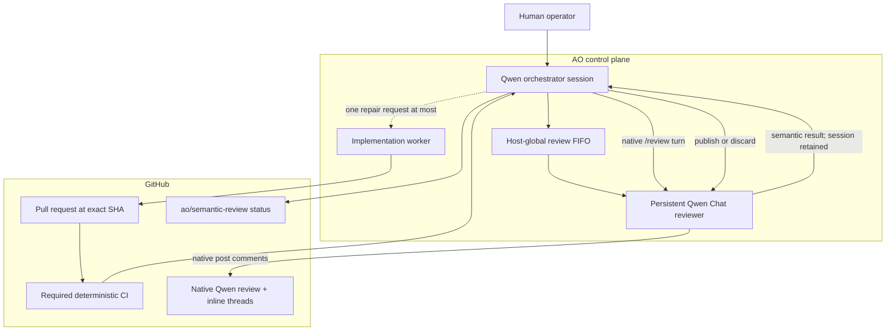
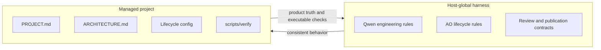

# AO + Qwen Code Harness

[](https://github.com/ensingerphilipp/AO-QwenCode-Harness/actions/workflows/verify.yml)

A reusable, production-oriented baseline for running **Agent Orchestrator (AO)** with **Qwen Code** as a controlled pull-request development system.

AO owns workflow state and authority. Qwen Code performs role-scoped reasoning and execution. Deterministic verification and a fresh semantic review independently gate every reviewed commit. A human remains the only merge authority.

> This is an orchestration and policy harness—not a model configuration, credential bundle, sandbox, or auto-merge system.

## Why this exists

A capable coding agent can edit a repository, but reliable autonomous development needs more than code generation:

- durable ownership of tasks, sessions, worktrees, and handoffs;
- a clean boundary between implementation and review;
- verification that does not depend on model judgment;
- semantic review bound to the exact commit that will be considered;
- fail-closed handling of stale heads, malformed results, interrupted reviews, and uncertain decisions;
- an explicit human boundary for product decisions and merge.

This harness gives those responsibilities one authoritative home instead of spreading them across prompts, agents, CI scripts, and GitHub automations.

## Architecture at a glance


```mermaid
flowchart TB
    H[Human operator]
    subgraph AO[AO control plane]
        O[Qwen orchestrator session]
        W[Implementation worker]
        Q[Host-global review FIFO]
        R[Persistent Qwen Chat reviewer]
    end
    subgraph GH[GitHub]
        PR[Pull request at exact SHA]
        CI[Required deterministic CI]
        NR[Native Qwen review + inline threads]
        ST[ao/semantic-review status]
    end
    W --> PR --> CI --> O
    O --> Q --> R
    O -->|native /review turn| R
    R -->|semantic result; session retained| O
    O -->|publish or discard| R
    R -->|native post comments| NR
    O --> ST
    O -. one repair request at most .-> W
    H --> O
```

AO remains the workflow authority. Qwen's native `/review` is the semantic authority and, after AO authorization, the publication authority for the GitHub review itself.

### Who owns what?

| Concern | Authority |
|---|---|
| Tasks, sessions, exact-SHA readiness, admission, routing | AO |
| Scoped implementation | Qwen implementation worker |
| Mechanical correctness | `scripts/verify` locally and in CI |
| Review effort | fixed native `high` for AO-managed publish-capable reviews |
| Semantic reasoning/findings/convergence | native Qwen `/review` |
| GitHub review body/event/inlines | same native Qwen reviewer after AO authorization |
| `ao/semantic-review` status | AO |
| Merge | Human |

## Pull-request lifecycle

1. Implementation worker verifies, pushes and hands off the canonical PR plus exact head SHA.
2. AO independently checks open/non-draft state and required deterministic CI for that SHA.
3. AO obtains the host-global FIFO slot. AO-managed review effort is fixed to native `high` because native PR publication is high-only. Before creating a reviewer, native argument parsing must prove the verdict turn is non-posting (`comment.effective == false`) for the exact PR command.
4. AO creates one dedicated **Chat/ACP** Qwen reviewer and establishes `reviewKey = owner/repo#PR@SHA`.
5. AO sends one native `/review <PR-URL> --effort high` turn to that same session.
6. Qwen completes the verdict-only native review normally and reports semantic event metadata to AO; the same reviewer conversation remains available.
7. AO revalidates the live head. If unchanged it sends one publish authorization; if moved/cancelled it sends discard.
8. The same Qwen session either follows native `post comments` or posts nothing. Qwen owns the internal state/persistence mechanics of that follow-up.
9. AO publishes the terminal `ao/semantic-review` status, releases the FIFO slot and may route one repair cycle.
10. A human decides whether to merge.

Semantic review is enabled by default and may be explicitly disabled by project lifecycle configuration.

## Why these design decisions?

### One controller, one semantic reviewer conversation

AO owns lifecycle state. Review reasoning is not delegated to a nested subprocess/session: the dedicated reviewer conversation itself executes native `/review` and remains alive through the later publication decision. This removes the prior AO Task -> Monitor -> Python runner -> second Qwen session stack.

### Exact commit identity everywhere

The orchestrator checks the PR head before dispatch, immediately before native review, after the semantic result, and immediately before publication authorization. A moved head invalidates publication of the old result.

### Two independent gates

Deterministic verification/CI and semantic review answer different questions. Both must pass for the exact head.

### No self-review

Implementation and review remain different AO sessions. The reviewer never repairs code; the implementation worker receives at most one repair request and reads the published native Qwen review directly.

### Review admission remains context-idle

Queued reviews create no reviewer or model activity. The FIFO ticket remains held until the active reviewer has completed the AO publish/discard phase and terminal acknowledgement, because that reviewer session remains reserved for the decision.

### Two-phase publication is an AO authorization boundary

The verdict phase is non-posting. Native `/review` may complete its normal cleanup. AO then checks the exact head and decides publish/discard; if publication is authorized, the same reviewer conversation follows Qwen's normal `post comments` path. AO leaves Qwen's internal follow-up mechanics entirely to native review behavior.

Before creating the reviewer, AO uses Qwen's native argument parser to prove that the exact verdict-phase command has `comment.effective == false`. A standing operator `review.comment: true` is incompatible with this harness lifecycle because Qwen would otherwise treat the initial review as already authorized to publish.

### Qwen owns review projection; AO owns permission

AO no longer projects findings into a separate summary comment and never creates native submit payloads. Qwen owns event/body/inline selection and thread behavior. AO only decides whether the already-completed review may be published and owns the independent `ao/semantic-review` status.

Historical AO summary comments are retained as history but are no longer created or updated.

### Fail closed on session loss

There is no automatic timeout/resume in the persistent-review architecture. If the reviewer conversation is lost or the native review is interrupted, AO does not spawn a replacement reviewer to publish the prior result.

### One automatic repair cycle; human merge

A first blocking native review may be routed once to the original worker when it is in scope and outside HITL boundaries. Any non-pass rereview stops for human attention. Merge is always human-controlled.

## Review support package

`global/qwen/skills/ao-pr-review/` now contains only protocol/policy documentation. The production review path has no semantic runner, effort selector, `qwen review run`, Qwen Monitor envelope, semantic artifact validator, AO findings compositor, or AO-owned semantic-review summary comment.

AO-managed reviews always use native `high` effort because Qwen's supported publication path is high-only. The previous `.qwen/review-config.json` risk/effort configuration is retired; existing repository copies are left untouched but new templates no longer create or consume it.

The model-hidden [`ao-semantic-review-override`](global/qwen/skills/ao-semantic-review-override/README.md) remains a human-only administrative escape hatch for the `ao/semantic-review` status. It does not create or alter a native Qwen review.

## Policy layout

Global, reusable behavior and project-owned truth are intentionally separated:


```mermaid
flowchart LR
    subgraph HOST[Host-global harness]
        Q[Qwen engineering rules]
        A[AO lifecycle rules]
        R[Review and publication contracts]
    end

    subgraph PROJECT[Managed project]
        P[PROJECT.md]
        D[ARCHITECTURE.md]
        C[Lifecycle config]
        V[scripts/verify]
    end

    HOST -->|consistent behavior| PROJECT
    PROJECT -->|product truth and executable checks| HOST
```

- Host-global rules answer: “How should every AO/Qwen project operate?”
- Project contracts answer: “What is this product, what must remain true, and where is human judgment required?”
- `scripts/verify` answers: “Which exact mechanical checks must pass?”
- Runtime state—sessions, worktrees, caches, credentials, and review evidence—is never treated as source configuration.

## Safety model

The harness is fail-closed around identity, evidence, and uncertain lifecycle transitions, but it is not a security sandbox. Qwen may run with an unattended approval mode, so safe deployment still requires an isolated, unprivileged environment and appropriately scoped credentials.

The intended defense in depth is:

- isolated AO worktrees and protected default branches;
- project-defined human-in-the-loop boundaries;
- local and CI verification using the same entry point;
- exact-SHA semantic review with publication-time head revalidation;
- persistent native Qwen review publication gated by explicit AO authorization;
- no automatic merge;
- retained evidence for audit and diagnosis.

Do not copy secrets, Qwen sessions, AO databases, worktrees, caches, or generated review evidence into a deployment.

## Installation

### Prerequisites

The target user must already have `python3`, `git`, `gh`, `qwen`, and `ao` in `PATH`. Qwen model/provider authentication and GitHub CLI authentication must already work. The harness does not install AO or Qwen and never writes model settings or credentials.

### Install host-global assets

```bash
git clone https://github.com/ensingerphilipp/AO-QwenCode-Harness.git
cd AO-QwenCode-Harness

bash install/install-host.sh --dry-run
bash install/install-host.sh
bash install/verify-install.sh
```

The manifest-controlled installer is idempotent. It fails on unmanaged or locally modified targets unless the operator explicitly authorizes a backed-up replacement.

### Initialize a new project

First run the read-only inspection contract in [`templates/prompts/inspect-project.md`](templates/prompts/inspect-project.md) and resolve every reported human decision. Then:

```bash
bash install/init-project.sh \
  --repo /absolute/path/to/repository \
  --inspection /absolute/path/to/inspection.json \
  --project-id my-project
```

Initialization renders project contracts and verification from observed repository facts, registers the AO project, configures Qwen workers and orchestrator, and verifies the resulting installation. It does not commit or push project changes.

For the full procedure, options, and ownership boundary, read [Installation and New-Project Initialization](docs/installation.md). Existing registered projects must use the preservation-first [migration procedure](docs/migration.md).

## Repository map

| Path | Purpose |
|---|---|
| [`global/qwen/`](global/qwen/) | Universal Qwen behavior and host-global Skills. |
| [`global/ao/`](global/ao/) | Worker, reviewer, orchestrator, and publication policy. |
| [`templates/project/`](templates/project/) | Project-owned contract and lifecycle templates. |
| [`templates/verify/`](templates/verify/) | Evidence-driven Go, Node, Python, Rust, Go+Node, and generic verification profiles. |
| [`templates/prompts/`](templates/prompts/) | Read-only project inspection contract. |
| [`config/`](config/) | Machine-readable schemas. |
| [`lifecycle/`](lifecycle/) | Project-neutral orchestrator refresh and host-global semantic-review admission. |
| [`install/`](install/) | Idempotent host installation, initialization, migration, and verification. |
| [`docs/`](docs/) | Architecture record, operating procedures, and current status. |

## Verify this repository

```bash
bash scripts/verify
```

This is the same fail-fast, non-repairing gate invoked by GitHub Actions.

## Current status

The reusable policy layers, project templates, verification profiles, installation/migration tooling, host-global deterministic review admission, and manual override are implemented. The prior review architecture had an accepted production-project smoke qualification covering issue intake, implementation, deterministic CI, exact-HEAD semantic review, GitHub publication, and manual merge. The new v0.4 persistent native-review backbone is implemented but still requires one clean end-to-end release-qualification run that produces exactly one native GitHub review.

Fresh-host/fresh-project end-to-end qualification also remains deliberately deferred. See [Current Harness Implementation Status](docs/status/current.md) for the authoritative progress record.

## Guiding invariant

> **AO owns workflow state and authority. Qwen performs role-scoped reasoning and execution. Deterministic gates produce evidence. Humans retain product judgment and merge authority.**
